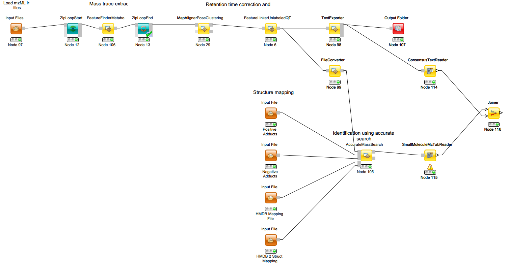

# (Galaxy) Metabolomics Projects
Three nationwide or europe-wide projects offer and support solutions for metabolomic data analysis integrated in the Galaxy framework.

## [Workflow4Metabolomics](https://Workflow4Metabolomics.org)
**Location**: France

**Aim**: build, test and provide workflows for metabolomics data analysis in Galaxy

**Current Status**: solutions for different experiment types exist (LC-MS, GC-MS, NMR)

**Accessibility**: public server (registration required), local installation possible

**Support**:
- some WFs and [tutorials](http://workflow4metabolomics.org/howto) with high quality exist, actively developed
- W4M Tutorials as PDFs are [here](./Tutorials/)
- post problems on [GitHub](https://github.com/workflow4metabolomics/workflow4metabolomics/issues)

## [OpenMS](http://www.openms.de/)
**Location**: Germany

**Aim**: build, test and provide new tools for mass spectrometry

**Current Status**: tools for different experiment types exist (LC-MS, GC-MS, NMR)

**Accessibility**: tools can be easily imported in any Galaxy server

**Support**: 
- a single WF / [tutorial](./OpenMS_Usertutorial_Metabolomics.pdf) on `UPLC-MS based, label-free quantitation` exists
- post problems on the mailing list (open-ms-general@lists.sourceforge.net) or on [GitHub](https://github.com/OpenMS/OpenMS/issues)

**Literature**:
- Kenar, 2014, Mol Cell Proteomics
- Ranninger, 2016, Anal Chim Acta
- Ranninger, 2015, J Biol Chem

## [PhenoMeNal](http://phenomenal-h2020.eu/home/)
**Location**: Europe (Halle)

**Aim**: build, test and provide metabolomics solutions in Galaxy

**Current Status**: solutions for different experiment types exist (mainly NMR, but also LC-MS and GC-MS)

**Accessibility**:
- [public server](http://public.phenomenal-h2020.eu) (registration required), can also run locally
- OMS tools and / or W4M tools and / or your favorite tools can be integrated

**Support**:
- no WFs / tutorials exist
- Highly interested in giving feedback on specific problems and to adjust their server to your needs
- post problems [**primarily on this page**](https://github.com/Stortebecker/metabolomics/issues) or, alternatively, on the [PhenoMeNal GitHub page](https://github.com/phnmnl/phenomenal-h2020)